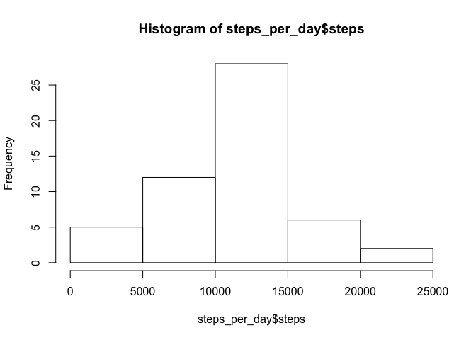
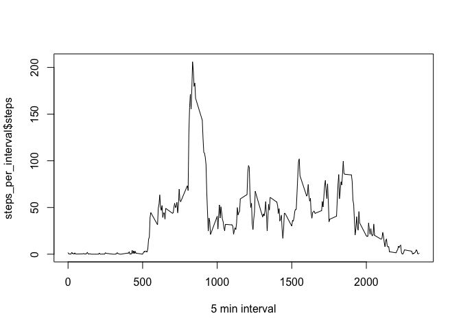
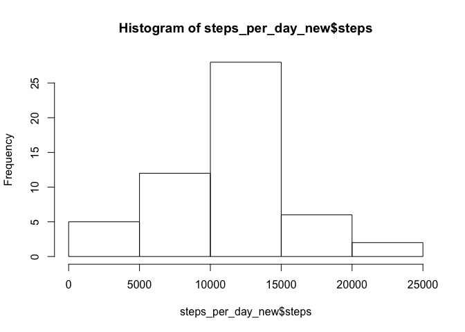
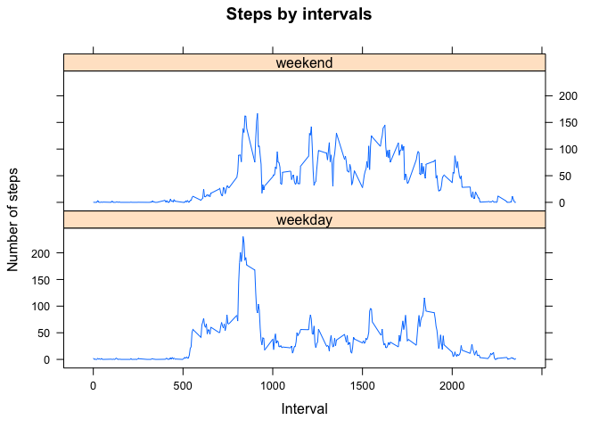

## Loading and preprocessing the data

```r
library(lattice)

dataPath <- "activity.csv"
data <- read.csv(dataPath)
data$date <- as.Date(as.character(data$date))
head(data)
```

```
##   steps       date interval
## 1    NA 2012-10-01        0
## 2    NA 2012-10-01        5
## 3    NA 2012-10-01       10
## 4    NA 2012-10-01       15
## 5    NA 2012-10-01       20
## 6    NA 2012-10-01       25
```


## What is mean total number of steps taken per day?

```r
steps_per_day <- aggregate(steps ~ date, data, FUN = sum, na.rm = TRUE)

head(steps_per_day)
```

```
##         date steps
## 1 2012-10-02   126
## 2 2012-10-03 11352
## 3 2012-10-04 12116
## 4 2012-10-05 13294
## 5 2012-10-06 15420
## 6 2012-10-07 11015
```

```r
hist(steps_per_day$steps)
```

<!-- -->


```r
mean(steps_per_day$steps,na.rm = TRUE)
```

```
## [1] 10766.19
```

```r
median(steps_per_day$steps, na.rm = TRUE)
```

```
## [1] 10765
```

## What is the average daily activity pattern?


```r
steps_per_interval <- aggregate(steps ~ interval, data, FUN=mean, na.rm=TRUE)
plot(steps_per_interval$interval, steps_per_interval$steps, type='l', xlab='5 min interval')
```

<!-- -->

```r
max_idx <- which.max(steps_per_interval$steps)
max_interval <- steps_per_interval[max_idx,]$interval
```

The 5-minute interval contains the maximum number of steps is: 

```r
max_interval
```

```
## [1] 835
```

## Imputing missing values

```r
sum(is.na(data$steps))
```

```
## [1] 2304
```

```r
#data$interval

new_data<- data
for(i in 1:nrow(new_data)){
    if (is.na(new_data$steps[i])){
        new_data$steps[i] <- steps_per_interval[steps_per_interval$interval==new_data$interval[i],]$steps
    }
}

steps_per_day_new <- aggregate(steps ~ date, data, FUN=sum, na.rm=TRUE)
head(steps_per_day_new)
```

```
##         date steps
## 1 2012-10-02   126
## 2 2012-10-03 11352
## 3 2012-10-04 12116
## 4 2012-10-05 13294
## 5 2012-10-06 15420
## 6 2012-10-07 11015
```

```r
hist(steps_per_day_new$steps)
```

<!-- -->

```r
mean(steps_per_day_new$steps, na.rm=TRUE)
```

```
## [1] 10766.19
```

```r
median(steps_per_day_new$steps, na.rm=TRUE)
```

```
## [1] 10765
```

## Are there differences in activity patterns between weekdays and weekends?


```r
new_data$weekdays <- factor(weekdays((new_data$date)) %in% c('Saturday', 'Sunday'),
                            levels = c(FALSE, TRUE), labels=c('weekday', 'weekend'))

#new_data
new_data_by_interval <- aggregate(steps ~ interval + weekdays, new_data, mean)

#new_data_by_interval

xyplot(steps ~ interval | weekdays, new_data_by_interval, type = "l", layout = c(1, 2), xlab = "Interval", ylab = "Number of steps", main = 'Steps by intervals')
```

<!-- -->
